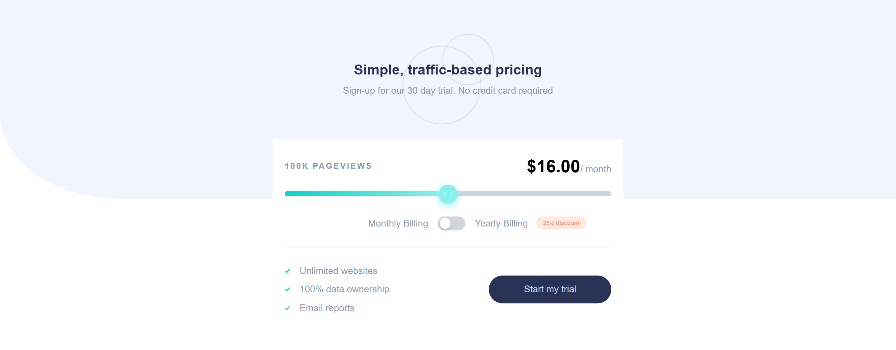
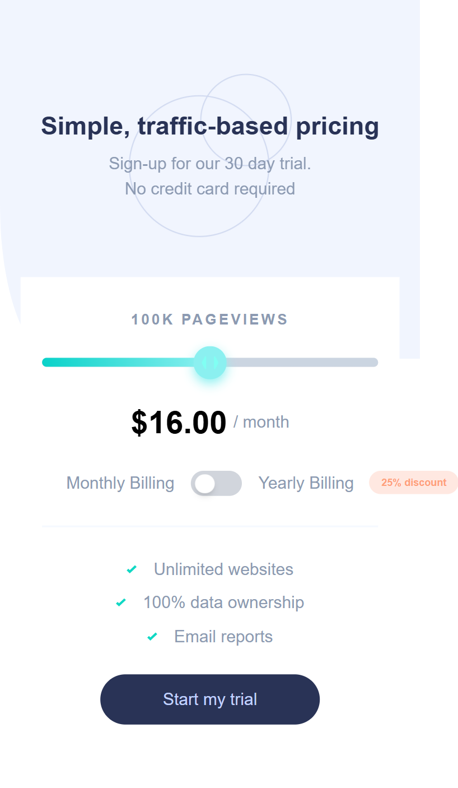

## Table of contents

- [Overview](#overview)
  - [The challenge](#the-challenge)
  - [Screenshot](#screenshot)
  - [Links](#links)
- [My process](#my-process)
  - [Built with](#built-with)
  - [What I learned](#what-i-learned)
  - [Continued development](#continued-development)
  - [Useful resources](#useful-resources)
- [Author](#author)

## Overview

### The challenge

Users should be able to:

- View the optimal layout for the site depending on their device's screen size
- See hover states for all interactive elements on the page

### Screenshot

### Links

- Solution URL: [Add solution URL here](https://github.com/DHBLee/DHBLee5/tree/DHBLee/Fronend-Mentor/Pricing)
- Live Site URL: [Add live site URL here](https://dhb-lee5-99e1.vercel.app/)

## My process

Installed Vite and node.js to create a web app that already handles react and tailwindcss frameworks

### Built with

- Semantic HTML5 markup
- CSS custom properties
- REACT
- TailwindCSS
- Mobile-first workflow
- JS

### What I learned

I learned a lot about REACT and TailwindCSS because it's my frist time using it 

### Continued development

I will continue to build web apps by using REACT and TailwindCSS

### Useful resources

- [Example resource 1](https://www.chatgpt.com) - Of Cos!

## Author

[@DHBLee](https://www.frontendmentor.io/profile/DHBLee)
